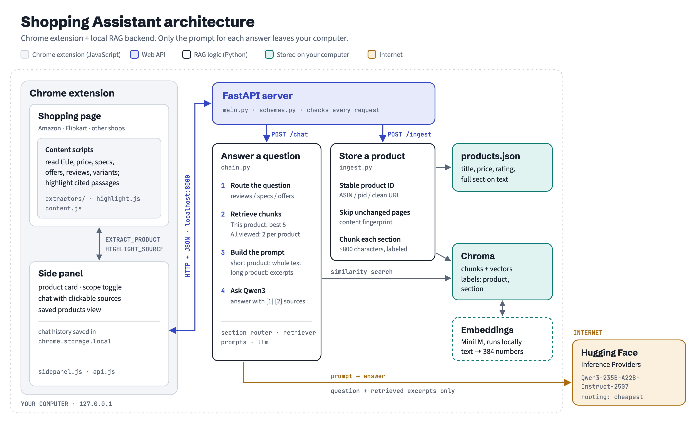

# Shopping Assistant

A Chrome extension that lets you **chat about the product you're viewing** on Amazon India, Flipkart and other shops, and **compare every product you've viewed**, powered by a local retrieval-augmented generation (RAG) backend.


- **"This product":** "Does this phone support fast charging?", "What do reviewers complain about?", "Is there a bank offer?"
- **"All viewed products":** "Compare the last three phones I looked at", "Which of these has a 120Hz display?", "Which one is cheapest?"
- Answers cite numbered sources. **Click a source to highlight the passage on the page.**

---

## Why this project needs RAG

A question about *one* product can often be answered by pasting the whole page into the LLM. A question across *every product you've viewed* can't: no single page contains the answer, and all products together are too much text for one prompt. The backend therefore stores every product as labeled chunks with embeddings, **retrieves the relevant pieces from each product**, and gives only those to the LLM.

## Features

- **In-browser extraction:** content scripts read title, price, rating, description, specs, offers, reviews and variants (colours, storage) straight from the page you're looking at. No server-side scraping.
- **Section-aware chunks:** every product is split into `description`, `specs`, `offers` and `reviews` chunks. A keyword router sends "What do reviewers say…" only to review chunks (metadata filtering).
- **Two answering modes:** short products are given to the LLM in full (`full_context`); long ones (many reviews loaded) use retrieved excerpts only (`rag`).
- **Balanced comparisons:** "All viewed products" retrieves 2 chunks **per product** for the 8 most recent products, so one product with 60 reviews can't crowd out the others.
- **Source highlighting:** clicking a source chip highlights the passage on the page; the top source is highlighted automatically.
- **Memory:** products survive restarts (Chroma + a JSON file); chats are saved per product in Chrome's own storage.
- **Saved products view** with delete / delete all.
- **Follows you:** re-reads the page on tab switch and navigation, with a "Refresh page data" button (e.g. after scrolling to load more reviews).

## Architecture

<picture>
  <source media="(prefers-color-scheme: dark)" srcset="docs/architecture-dark.png">
  
</picture>

The project has two independent parts that talk **only** through an HTTP API:

| Part | Tech | Job |
|---|---|---|
| **Chrome extension** | Manifest V3, plain JavaScript, HTML, CSS | Extract the product from the page, show the chat in Chrome's side panel, highlight sources |
| **Backend** | Python, FastAPI, LangChain, Chroma | Store and chunk products, embed them, retrieve, call the LLM |

**Storing a product (`POST /ingest`):** stable product ID (Amazon ASIN, Flipkart `pid`, or the clean URL) → content hash (unchanged page = nothing to redo) → split each section separately into ~800-character chunks → embed with a local MiniLM model → store in Chroma, plus a product record in `products.json`.

**Answering (`POST /chat`):** route the question to sections → similarity search in Chroma, filtered by product and section → build the prompt (product card, then the full text or numbered excerpts) → Qwen3 answers with `[1] [2]` citations → the numbered excerpts are returned as sources.

## Tech stack

| Purpose | Tool |
|---|---|
| Web API | FastAPI + Uvicorn, Pydantic v2 |
| RAG framework | LangChain (`langchain-core`, `langchain-text-splitters`, `langchain-huggingface`, `langchain-chroma`) |
| LLM | `Qwen/Qwen3-235B-A22B-Instruct-2507` via Hugging Face Inference Providers (cheapest provider) |
| Embeddings | `sentence-transformers/all-MiniLM-L6-v2`, running locally |
| Vector store | Chroma (persisted to disk) |
| Prototype UI | Streamlit |
| Tests | pytest (LLM mocked) |
| Extension | Chrome Manifest V3, Side Panel API, `chrome.storage.local`, no build step |

---

## Setup

### Prerequisites
- **Python 3.11 or newer** (developed with 3.12)
- **Google Chrome 116 or newer** (for the side panel)
- A free **Hugging Face account** and access token (the LLM runs on Hugging Face's partners, not on your computer)

### 1. Get a Hugging Face token
1. Sign in at [huggingface.co](https://huggingface.co) and open **Settings → Access Tokens → Create new token**.
2. Choose **Fine-grained** and tick **"Make calls to Inference Providers"**, then create and copy the token (starts with `hf_`).

Free accounts get a small monthly inference credit; see [Troubleshooting](#troubleshooting) if you run out.

### 2. Install the backend

macOS / Linux:
```bash
cd backend
python3 -m venv .venv            # use python3.12 if python3 is older than 3.11
source .venv/bin/activate
pip install -r requirements.txt
cp .env.example .env
```

Windows (PowerShell):
```powershell
cd backend
py -3.12 -m venv .venv
.venv\Scripts\Activate.ps1
pip install -r requirements.txt
copy .env.example .env
```

Open `backend/.env` and replace `hf_your_token_here` with your token. The install is large (PyTorch comes with `sentence-transformers`), and the ~90 MB embedding model downloads on first use.

Check the LLM connection:
```bash
python -m scripts.hello_llm
```

### 3. Start the backend
```bash
uvicorn app.main:app --port 8000
```
Keep this terminal open. The API docs are at <http://localhost:8000/docs>.

### 4. Load the extension
1. Open `chrome://extensions` and turn on **Developer mode** (top right).
2. Click **Load unpacked** and select the `extension/` folder.
3. Pin **Shopping Assistant** from the puzzle-piece menu.
4. Open a product page on amazon.in or flipkart.com (reload it if it was already open) and click the icon.

The side panel saves the product and shows a card. Ask a question under **This product**, open a few more products, then switch to **All viewed products** to compare them.

---

## Other ways to run it

All of these use the same backend code in `backend/app/`, from the `backend/` folder with the virtual environment active:

| Command | What it does |
|---|---|
| `python -m scripts.rag_cli` | Terminal chat over four fictional sample products |
| `python -m streamlit run scripts/streamlit_app.py --browser.gatherUsageStats false --server.address localhost` | Web prototype with sources, at <http://localhost:8501> |
| `python -m scripts.run_eval --label baseline` | Asks the 14 evaluation questions and writes `tests/eval_raw_baseline.md` (`--questions 10-14` runs a subset) |
| `python -m pytest` | 44 tests; the LLM is mocked, so no token or credits are needed |

## Configuration

All settings live in `backend/.env` (see `.env.example`); every one except the token has a default.

| Setting | Default | Meaning |
|---|---|---|
| `LLM_MODEL` | `Qwen/Qwen3-235B-A22B-Instruct-2507` | Chat model on Hugging Face |
| `LLM_ROUTING` | `cheapest` | Which provider runs the model: `cheapest`, `fastest`, `preferred`, or a provider name |
| `LLM_MAX_TOKENS` | `512` | Maximum answer length |
| `FULL_CONTEXT_CHAR_LIMIT` | `12000` | Products up to this many characters of section text are given to the LLM whole |
| `CHUNK_SIZE` / `CHUNK_OVERLAP` | `800` / `100` | Chunk length and overlap, in characters |
| `CURRENT_TOP_K` | `5` | Chunks retrieved for "This product" |
| `PER_PRODUCT_K` / `MAX_COMPARE_PRODUCTS` | `2` / `8` | Chunks per product, and how many recent products, for "All viewed products" |
| `MAX_HISTORY_MESSAGES` | `6` | Earlier chat messages sent with each question |
| `DATA_DIR` | `./data` | Where Chroma and `products.json` are stored |

---

## Design decisions

- **Extract in the browser, never on the server.** Amazon and Flipkart block automated requests, load prices and reviews with JavaScript, and vary delivery by location. The browser already shows exactly what the user sees.
- **Product-specific extractors, not a generic article reader.** Readability-style tools drop price blocks, spec tables and reviews. Each site has its own extractor with every selector in one `SELECTORS` object; stable hooks are preferred in this order: JSON-LD → IDs and `data-*` attributes → heading text → class names (never Flipkart's auto-generated ones).
- **Chunk each section separately.** A chunk never mixes specs and reviews, so every chunk has one section label to filter on.
- **Whole product when it fits, excerpts when it doesn't.** Short pages lose nothing; long pages stay within a sensible prompt size. Retrieval runs in both modes so every answer has sources.
- **Retrieve per product for comparisons.** A single global search can return chunks from only one product.
- **Stateless backend for conversations.** The extension keeps chat history and sends the recent turns with each question; the backend never stores chats.
- **Local by default.** Products, chunks, embeddings and chats stay on your computer. Only the question and its retrieved context are sent to the LLM provider. The token lives only in `backend/.env`.
- **Safe rendering.** Page text and LLM output are inserted with `textContent` / DOM nodes, never `innerHTML`.

## Evaluation

A 14-question set (`backend/tests/eval_questions.json`) covers review, spec and offer questions, cross-product comparisons, and two questions whose answer isn't in the data. Answers are graded by hand in `backend/tests/eval_results.md`.

| Model | Answers (✅ / ⚠️ / ❌) | Notes |
|---|---|---|
| Llama 3.1 8B (questions 1–9 only) | 4 / 5 / 0 | Retrieval was right, but the model prefixed correct answers with "I couldn't find that", missed citations and ignored the "prices may have changed" rule |
| **Qwen3-235B-Instruct** (all 14) | **12 / 2 / 0** | Both unanswerable questions correctly refused; remaining issues: an answer cut off at 512 tokens, and a fact buried in a long spec list not retrieved with 2 chunks per product |

The retrieved chunks were nearly identical for both models, which isolated the model as the cause and is why the project uses Qwen3.

## Privacy

- Nothing is sent anywhere except the question and its retrieved product excerpts, to Hugging Face's inference provider, when you ask something.
- Chroma's anonymous telemetry is turned off.
- The backend only listens on `localhost`, and CORS only allows the extension and the local Streamlit app.

## Known limitations

- **Only content loaded on the page is available.** If a product has thousands of reviews but the page shows ten, the assistant only knows those ten. "See more reviews" pages are never opened.
- **Flipkart's "All details" area is tabbed:** only the open tab's text (e.g. Specifications or Description) is on the page.
- **Site layouts change,** so selectors will need updating from time to time (each is marked with the date it was last verified).
- **Prices and offers are snapshots** from when the page was viewed. For Amazon variants, only the selected variant's price is known; Flipkart colour names aren't on the page, so they're counted instead of named.
- **Comparisons use only the most relevant few excerpts per product,** and only the 8 most recently viewed products.
- **Highlighting** can't find text that spans several page elements (e.g. a spec label and value in separate table cells); the panel says so.
- **The backend runs on your own computer,** so it must be started before using the extension.
- The four sample products are fictional.

## Troubleshooting

| Problem | Fix |
|---|---|
| "Can't reach the backend…" | Start it: `uvicorn app.main:app --port 8000` from `backend/` with the virtual environment active |
| "Please reload this page" | The extension was installed or updated after the tab was opened; reload the tab |
| "The AI service had a problem… credits are used up" (HTTP 402) | Your Hugging Face credit is used up; check <https://huggingface.co/settings/billing> |
| "This page can't be read by extensions" | Chrome doesn't allow extensions on `chrome://` pages, the Web Store or PDFs |
| A section shows nothing (e.g. no reviews) | Scroll to it so the site loads it, then click **Refresh page data** |

## Project structure

```
backend/
  app/
    main.py            FastAPI endpoints (thin: validate, call app code, return)
    ingest.py          storing a product (shared by API, CLI, Streamlit)
    rag/               documents, embeddings, vectorstore, section_router,
                       retriever, prompts, llm, chain (the RAG pipeline)
    config.py  schemas.py  product_store.py  product_id.py
  scripts/             hello_llm, rag_cli, streamlit_app, run_eval
  samples/products/    four fictional products
  tests/               pytest suites + evaluation set and results
extension/
  manifest.json  background.js  config.js
  content/             extractors (common, amazon, flipkart, generic),
                       highlight.js, content.js, content.css
  sidepanel/           sidepanel.html/.css/.js, api.js, storage.js
docs/                  architecture.png, demo.gif
```

## Possible improvements

- Stream answers token by token.
- Replace the keyword section router with an LLM-based classifier.
- Rewrite follow-up questions ("and its camera?") into standalone queries before retrieval.
- Add numbered citations for prices (they come from the product card, not an excerpt).
